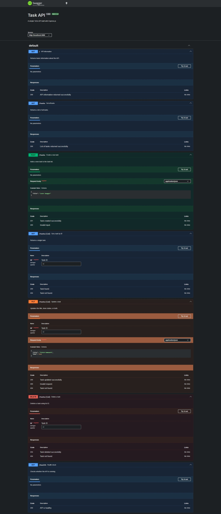
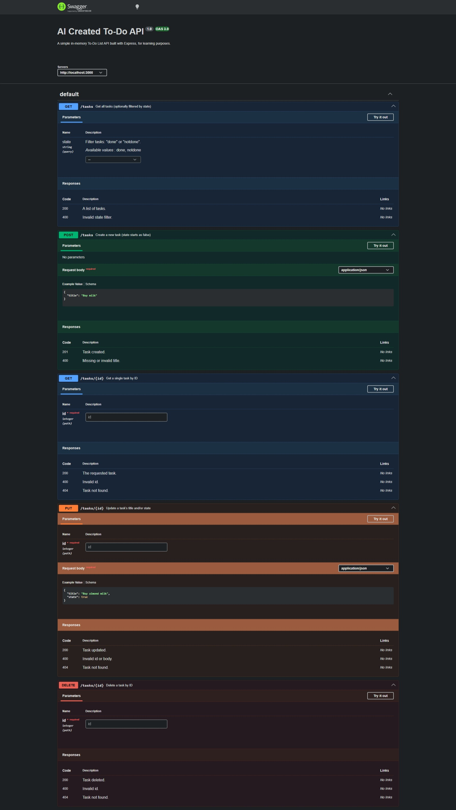

# To-Do API

A simple REST API for managing a list of tasks. Built with Node.js and Express.

There is no database. Tasks are stored in memory in an array, so everything
resets when the server restarts. There is no login or authentication.

## Files

- index.js - the whole app (server, routes, Swagger setup)
- package.json - dependencies and project info

## Requirements

- Node.js installed

## Install

```
npm install
```

## Run

```
node index.js
```

The server runs on port 3000.

- API: http://localhost:3000
- Swagger docs: http://localhost:3000/api-docs

## Task Fields

- id: number, set automatically by the server
- title: string, the text of the task
- done: boolean, true or false

Example task:

```
{
  "id": 1,
  "title": "Buy milk",
  "done": false
}
```

## Endpoints

| Method | Path         | Description        |
|--------|--------------|---------------------|
| GET    | /            | API info            |
| GET    | /health      | Health check        |
| GET    | /tasks       | Get all tasks       |
| GET    | /tasks/:id   | Get one task        |
| POST   | /tasks       | Create a task       |
| PUT    | /tasks/:id   | Update a task        |
| DELETE | /tasks/:id   | Delete a task        |

## Example

```
$ curl -i http://localhost:3000/tasks

HTTP/1.1 200 OK
X-Powered-By: Express
Content-Type: application/json; charset=utf-8
Content-Length: 116

[{"id":1,"title":"Task 1","done":false},{"id":2,"title":"Task 2","done":true},{"id":3,"title":"Task 3","done":false}]
```

## Swagger UI



## Notes

- Errors are returned as JSON but the field name is not always the same
  (some use "error", some use "message"). This is inconsistent and could
  be cleaned up later.
- There is no filtering (for example by done/not done) yet.
- There is no validation that title is actually a string, just that it
  is not empty/falsy.
